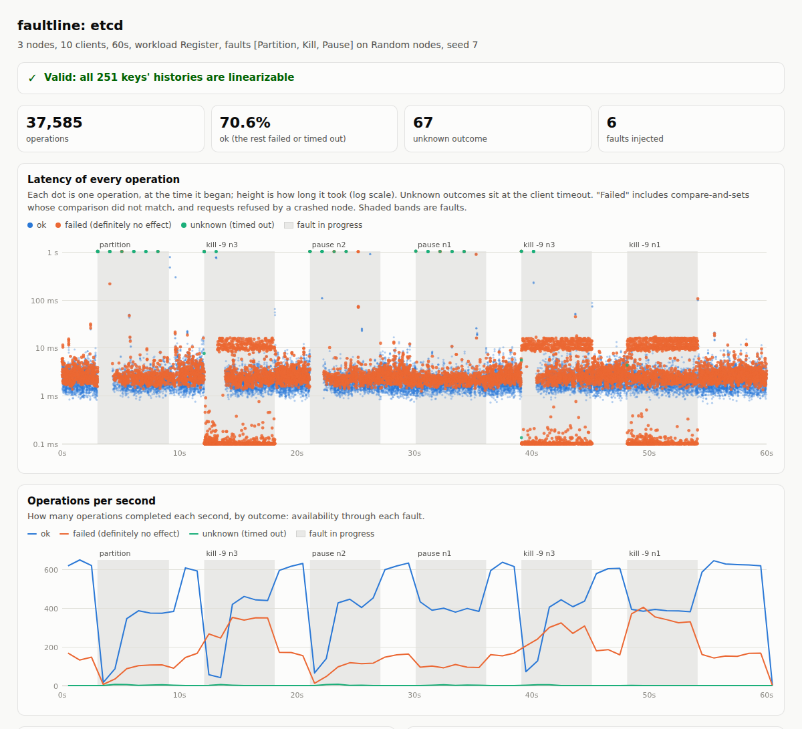

# faultline

[](https://github.com/Shakhtar-Sankur/faultline/actions/workflows/ci.yml)

Jepsen-style fault injection for real databases, in Rust, with zero
dependencies.

faultline runs a real cluster on one Linux machine, each node in its own
network namespace with its own IP address, and drives it with concurrent
clients while it cuts the network with iptables, crashes nodes with
`kill -9`, and freezes them with `SIGSTOP`. It records every operation (when
it started, when it ended, and whether it succeeded, failed, or timed out
with an unknown outcome) and then checks the history for
**linearizability**, the strongest single-object consistency guarantee.

The target today is **etcd**, the consensus store behind Kubernetes: its
key-value operations for linearizability, its locks for mutual exclusion
and lost updates, and its watch streams for order and completeness.

## Does it work? It catches stale reads, and passes correct ones

A checker that never fails proves nothing, so the first test is one it
must fail. etcd offers *serializable* reads, served by any node from its
local copy without consulting a quorum: faster, and documented as possibly
stale. Under network partitions faultline catches them:

```
$ sudo faultline test etcd --etcd ./etcd --time 60 --faults partition --serializable-reads
etcd (serializable reads) on 3 nodes, 10 clients, 60s, faults [Partition], seed 7

  op          ok    fail  unknown   latency of ok (p50 / p99)
  read     19019       0        0   1.0 / 2.9 ms
  write     9483       0       62   2.3 / 6.1 ms
  cas       1796    7652       66   2.5 / 6.6 ms

  faults injected:
       3.003s  partition: [n1] | [n3 n2]
       9.115s  heal: network restored
  ...
  INVALID: 47 of 254 keys' histories are not linearizable
```

and for each key it shows why: the longest valid order of operations it
could find, and the reads that no order can explain. From a 30-second run
(seed 11):

```
  key 16: no order of these 118 operations is a valid register history. The longest valid order found places 112 of them; its last steps:
    ...
    ok       3.037s..3.039s    p2   n3  key 16   ok    write 3   => register 3
    ok       3.038s..3.041s    p9   n1  key 16   ok    read 3   => register 3
    ok       3.038s..3.042s    p5   n3  key 16   ok    cas 3 -> 0   => register 0
    ok       3.043s..3.044s    p8   n3  key 16   ok    read 0   => register 0
  then none of these can come next:
    stuck    3.045s..3.046s    p4   n2  key 16   ok    read 4
    stuck    3.047s..3.048s    p1   n2  key 16   ok    read 4
```

Node 2 kept answering 4 after the register had moved on to 3 and then 0.

The same test with etcd's default, linearizable reads, under partitions,
crashes and pauses together, passes:

```
$ sudo faultline test etcd --etcd ./etcd --time 120 --faults partition,kill,pause --fault-gap 3 --fault-for 6 --seed 7
etcd on 3 nodes, 10 clients, 120s, faults [Partition, Kill, Pause], seed 7

  op          ok    fail  unknown   latency of ok (p50 / p99)
  read     34110    3076        0   2.0 / 6.6 ms
  write    17048    1500       60   2.5 / 6.9 ms
  cas       3261   15280       61   2.7 / 7.8 ms

  faults injected:
       3.002s  partition: [n1] | [n3 n2]
       9.104s  heal: network restored
      12.104s  kill -9 n3
      18.112s  restart n3
      21.113s  pause n2 (SIGSTOP)
      ...    (25 fault events in all)

  VALID: all 496 keys' histories are linearizable
```

(A failed `cas` is a compare-and-set whose comparison did not match: a
definite no, which the checker knows had no effect.)

CI runs both directions on every push, against a real etcd release.

## Every run leaves a report

Each run writes `report.html`: one self-contained page showing the latency
of every operation over time and throughput by outcome, with every fault
shaded and every violation marked, plus hover detail for each point. For
the passing run above: each partition and pause shows as a burst of
operations with unknown outcomes (dots at the one-second timeout) and a dip
in throughput; each `kill -9` shows the clients bound to the dead node
failing instantly while the rest carry on.



## Locks: what etcd's documentation warns about, measured

etcd's lock is held by whoever owns the oldest key under the lock's name,
and each key is tied to its owner's lease. If the owner stalls (a long GC
pause, a stalled VM) and its lease expires, the key vanishes and someone
else gets the lock, while the stalled owner still believes it holds it.
etcd's documentation therefore recommends making writes conditional on
still owning the lock. `--workload lock` measures both: every client, while
holding the lock, reads a counter and writes it plus one. The checker
reports times two clients held the lock at once (every client shares the
test machine's clock, so holding intervals compare directly) and **lost
updates**: acknowledged increments that read the same value.

| Run (etcd 3.5.17, 3 nodes, 10 clients) | Lock held twice at once | Increments fenced out | Lost updates | Verdict |
|---|---|---|---|---|
| Naive lock, no faults, 30 s | 0 | 0 | 0 | valid |
| Naive lock, 5% of holders stall past their lease, 40 s | 266 | 0 | **121** | **invalid** |
| Fenced writes (etcd's recommendation), same stalls, 40 s | 251 | 18 (one per stall) | 0 | valid |
| Naive lock, partitions, crashes and pauses of etcd nodes, no stalls, 120 s | 0 | 0 | 0 | valid |

```
$ sudo faultline test etcd --etcd ./etcd --workload lock --stall-percent 5 --time 40
  workload: lock (Lock { fenced: false, stall_percent: 5 }), 268 acquisitions, 19 stalled past their lease
  268 increments acknowledged, 0 refused by the fence
  mutual exclusion: 266 times two clients held the lock at once
  INVALID: 121 lost updates: acknowledged increments that read the same value
    counter 1: incremented by p[8, 1], each writing 2
```

A stalled holder wakes up and writes a value it read seconds earlier,
dragging the counter back, so one stall costs many updates. With fenced
writes each stalled holder's write is refused instead (18 stalls, 18
refusals) and nothing is lost, though the lock itself still overlaps: the
fence, not the lock, keeps the data safe. Faults on the etcd servers alone,
with short critical sections, did not break the lock in 120 seconds; the
hazard needs the holder itself to outlive its lease.

## Watches: the stream Kubernetes is built on

Every Kubernetes controller learns about changes through etcd watches.
etcd promises that a watcher receives events in revision order, without
duplicates, only for committed writes, with every watcher agreeing on what
happened at each revision, and without missing any. `--workload watch`
checks all of it: writers put unique values to a few keys while one watcher
per node streams every change, reconnecting after crashes and resuming just
after the last revision it saw, as real clients do. Each write creates
exactly one revision, so after the faults heal a watcher that has caught up
must have seen *every* revision from the first write to the last, exactly
once: a missed event cannot hide.

```
$ sudo faultline test etcd --etcd ./etcd --workload watch --time 90 --faults partition,kill,pause --fault-gap 3 --fault-for 6 --seed 12
  workload: watch, 53055 acknowledged writes, revisions up to 53092
  3 watchers received 159273 events over 90 reconnections; 3 of 3 caught up
  VALID: every watcher saw every revision once, in order, and all agreed
```

(Revisions exceed acknowledged writes by 37: writes that timed out during
faults but committed anyway. Counting them is why the checker compares
against revisions, not acknowledgements.)

To prove the checker can fail, `--watch-resume N` plants the classic client
bug: resuming from the last revision plus 0 (the last event is delivered
twice) or plus 2 (one event is skipped). Both are caught:

```
$ sudo faultline test etcd --etcd ./etcd --workload watch --watch-resume 0 --time 30 --faults kill,partition
  INVALID: 1 watch violations
    watcher 0 (n1) saw revision 5904 after 5904: out of order or duplicated
$ sudo faultline test etcd --etcd ./etcd --workload watch --watch-resume 2 --time 30 --faults kill,partition
  INVALID: 1 watch violations
    watcher 0 (n1) missed 1 revisions, first [7190]
```

## How it works

- **Nodes in network namespaces.** Each node gets a namespace, a veth pair
  onto a shared bridge, and its own address (10.77.0.11, .12, ...), so
  partitions are real dropped packets between real addresses, not a
  simulation. Clients run in the host namespace and reach every node.
- **Faults.** A partition splits the nodes into a majority and a minority,
  or cuts one node off, with iptables rules inside the namespaces.
  `--target leader` aims every fault at whichever node leads right now
  (found from each node's status), and follows leadership as it moves. A crash
  is `SIGKILL` and a restart from the node's data directory. A pause is
  `SIGSTOP`/`SIGCONT`, like a long GC pause or a stalled VM. The schedule
  is seeded, so a run can be repeated.
- **Honest outcomes.** A request that never reached the server (connection
  refused) definitely failed. One that timed out after it was sent may or
  may not have happened: it is recorded as *unknown*, and the checker lets
  it take effect at any time after it began, or never. Getting this wrong
  is how testers report bugs that are not there, or miss ones that are.
- **The checker.** Wing and Gong's linearizability search with Lowe's
  memoization, the algorithm behind Knossos and Porcupine, for a register
  with reads, writes and compare-and-set. Clients move to a fresh key every
  150 operations, and keys are checked independently (linearizability is
  compositional), which keeps every search exhaustive.
- **Everything saved.** Each run leaves `report.html`, `history.jsonl`
  (every operation), `nemesis.txt` (every fault, timestamped),
  `results.txt`, and each node's logs under `store/`.

## Run it

Linux and root (namespaces and iptables need them), `ip` and `iptables`,
and an etcd release binary:

```
curl -L https://github.com/etcd-io/etcd/releases/download/v3.5.17/etcd-v3.5.17-linux-amd64.tar.gz | tar xz
cargo build --release
sudo ./target/release/faultline test etcd --etcd etcd-v3.5.17-linux-amd64/etcd --time 60
sudo ./target/release/faultline cleanup   # only if a run was interrupted
```

Exit status: 0 valid, 1 invalid, 2 undecided, 3 error. Options: `faultline`
with no arguments lists them.

## Honest limits

- One database so far. Faults are partitions, crashes and pauses; clock
  skew, disk faults and membership changes are not yet modeled.
- Workloads are a single-key register, a lease-based lock and watches.
  Multi-key transactions are not yet checked.
- Every node shares one machine, so timing differs from a real
  multi-machine deployment; it finds ordering bugs, not performance ones.

## License

Apache-2.0. See [LICENSE](LICENSE).
